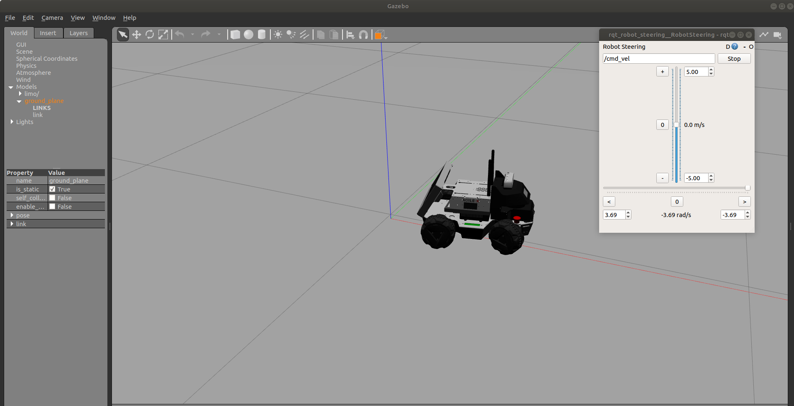

[TOC]

# limo仿真操作流程

## 一、功能包介绍

```
├── image
├── limo_description
├── limo_gazebo_sim
```

​	limo_description: 该文件为模型文件功能包

​	limo_gazebo_sim: 该文件夹为gazebo仿功能包

## 二、环境

### 开发环境

​	ubuntu 18.04 + [ROS Melodic desktop full](http://wiki.ros.org/melodic/Installation/Ubuntu)

### 下载安装必备功能包

​	下载安装ros-control功能包，ros-control是ROS提供的机器人控制中间件

```
sudo apt-get install ros-melodic-ros-control
```

​	下载安装ros-controllers功能包，ros-controllers是ROS提供的常见车型运动学插件

```
sudo apt-get install ros-melodic-ros-controllers
```

​	下载安装gazebo-ros功能包，gazebo-ros是gazebo和ROS之间的通信接口，将ROS和Gazebo连接起来

```
sudo apt-get install ros-melodic-gazebo-ros
```

​	下载安装gazebo-ros-control功能包， gazebo-ros-control是在ROS和Gazebo之间通信的标准控制器

```
sudo apt-get install ros-melodic-gazebo-ros-control
```

​	下载安装rqt-robot-steering插件，rqt_robot_steering是与机器人运动控制的密切相关的ROS工具，它可以发布机器人直线运动和转向运动的控制指令，通过滑动条可以十分方便地控制机器人运动

```
sudo apt-get install ros-melodic-rqt-robot-steering 
```

​	下载安装teleop-twist-keyboard 功能包，teleop-twist-keyboard是键盘控制功能包，可以通过键盘上的“i”，“j”，“l”，“，”控制机器人前进，向左，向右，后退

```
sudo apt-get install ros-melodic-teleop-twist-keyboard 
```


## 三、用法

### 1、创建工作空间、下载仿真模型功能包并编译

​		打开一个新终端，创建一个工作空间，名字为limo_ws，在终端中输入：

```
mkdir limo_ws
```

​		进入到limo_ws文件夹中

```
cd limo_ws
```

​		创建一个用于存放功能包的文件夹，名字为src

```
mkdir src
```

​		进入到src文件夹

```
cd src
```

​		初始化文件夹

```
catkin_init_workspace
```

​		下载仿真模型功能包

```
git clone https://github.com/agilexrobotics/ugv_sim/limo.git
```

​		进入limo_ws文件夹

```
cd limo_ws
```

​		确认功能包的依赖有没有安装好

```
rosdep install --from-paths src --ignore-src -r -y 
```

​		进行编译

```
catkin_make
```


### 2、运行limo的模型启动文件，在Rviz中可视化urdf文件

​	进入到limo_ws文件夹

```
cd limo_ws
```

​	声明环境变量

```
source devel/setup.bash
```

​	运行limo的模型启动文件，在Rviz中可视化模型

roslaunch limo_description display_models.launch 

 

### 3、启动limo的gazebo仿真环境，并在gazebo中控制limo运动

​	进入到limo_ws文件夹

```
cd limo_ws
```

​	声明环境变量

```
source devel/setup.bash
```

​	启动limo仿真环境，limo有两种运动模式，本次运动模式为阿克曼运动模式

```
roslaunch limo_gazebo_sim limo_ackerman.launch
```

​	启动rqt_robot_steering运动控制插件，滑动滑动条可以控制机器人运动

```
rosrun rqt_robot_steering rqt_robot_steering
```

 

四轮差速运动模式

```
roslaunch limo_gazebo_sim limo_four_diff.launch 
```

键盘控制，可以通过键盘上的“i”，“j”，“l”，“，”控制机器人前进，向左，向右，后退

```
rosrun teleop_twist_keyboard teleop_twist_keyboard.py 
```

 

 

 
